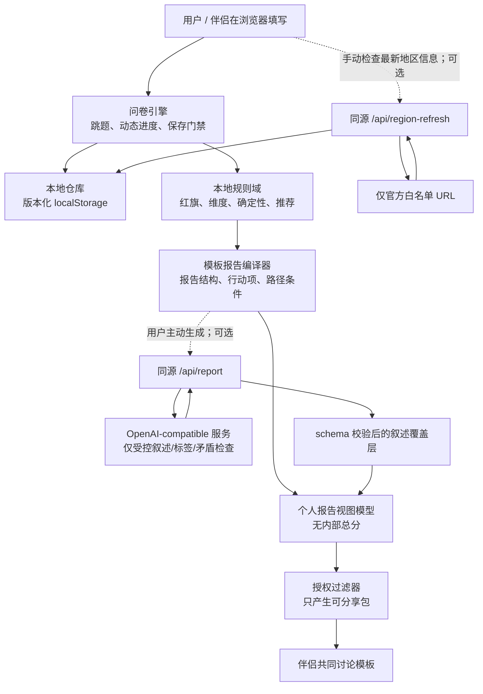

# Should We Continue MVP 技术实现方案

> 版本：v0.1（实施前方案）  
> 编制日期：2026-06-26  
> 依据：`AGENTS.md`、`spec.md`、`specs/research.md`、`specs/questionnaire.md`、`specs/scoring.md`、`specs/personas.md`、`specs/report.md`

## 1. 方案结论

本 MVP 应实现为一个**本地优先、规则优先、单页 React 应用**：问卷答案与报告仅保存在当前浏览器；红旗、评分、推荐、角色选择与共享过滤完全由可测试的本地规则决定；大模型仅通过 Vercel Function 对已经脱敏、结构化且受限的输入进行叙述润色和矛盾提示。模型不可参与红旗、评分、路径选择或共享范围判断。

核心实施顺序如下：

1. 锁定仍缺失的专业规则和题库元数据。
2. 先用 Vitest 为纯规则写失败测试，再实现问卷、评分、报告与隐私过滤。
3. 在无模型、无网络时完成可用的模板报告闭环。
4. 再接入受控 LLM、地区信息手动刷新、伴侣独立测评与正式角色插画。
5. 以本地存储失败、R3/R4、未授权共享和模型失败作为发布阻断场景验证。

这份方案不启动脚手架、依赖安装、代码编写、联网检索或部署；这些工作须在第 3 节的实施闸门关闭并获得单独确认后开始。

## 2. 目标、边界与架构决策

### 2.1 产品目标

- 帮助用户结构化梳理医学确认、心理支持、自主安全、个人意愿、伴侣承诺、家庭支持、经济资源、已有子女照护与价值冲突。
- 用中性、对称的条件清单帮助用户分别审视“继续妊娠”和“终止妊娠”两条路径。
- 红旗出现时，立即把线下医疗、心理或安全支持置于一切分析之前。
- 为双方在**各自明确授权后**生成讨论材料，而不是把个人报告自动交给伴侣。

### 2.2 MVP 明确不做

- 医疗、心理或法律诊断；具体药物、手术、治疗方案；妊娠去留建议。
- 账号、数据库、云端历史、跨设备同步、行为分析、错误监控、定时任务或一般性爬虫。
- 地区选择、主题切换、无伴侣流程、伴侣责任追踪、提醒、期限或完成核验。
- 占卜、预测、命运论或“人格决定去留”的表达。

### 2.3 关键架构决策

| 决策 | 选择 | 原因 |
| --- | --- | --- |
| 前端形态 | React + Vite 单页应用；不引入路由和状态管理框架 | 页面状态有限，`useReducer` 与显式服务注入足够且更易审计。 |
| 业务核心 | 与 React 无关的 TypeScript 纯函数 | 红旗、评分、跳题、分享过滤能在 Vitest 中独立验证。 |
| 存储 | 一个版本化 `localStorage` 文档，内含独立用户、伴侣、共享及地区缓存命名空间 | 无账号、无云端；删除范围可精确实现。 |
| 校验 | 题库、存储、API 和模型输出都使用仓库内的窄类型守卫/解析器 | 避免为 MVP 增加通用运行时框架，同时保留显式 schema 校验。 |
| 报告生成 | 本地模板永远可用；LLM 仅作为覆盖层（narrative overlay） | API Key 缺失或服务失败不影响安全结论和报告结构。 |
| 服务端 | Vercel Functions；开发环境由 Vite 的极薄同构中间件复用同一处理器 | 密钥不进入浏览器；`npm run dev` 可验证受控 API 而不建立常驻后端。 |
| 地区信息 | 内置杭州滨江区静态配置；仅用户手动触发后访问固定官方白名单 | 不做自动抓取，也不让模型生成政策事实。 |

## 3. 实施闸门与待锁定项

专项文档已经给出了结构和边界，但 `scoring.md` 与量表相关规格仍明确标记了实现前需细化的内容。以下事项未关闭前，**不得实现核心题库、评分、报告或模型调用**。

| 闸门 | 必须产物 | 责任性要求 | 关闭标准 |
| --- | --- | --- | --- |
| G1：题库标识 | 每题的稳定 `answerKey`、题型、选项值、必答/可跳过、可见条件、敏感级别、所属维度 | 不允许用 UI 文案或数组下标作为规则键 | 题库能通过静态完整性校验，且问卷、评分只引用稳定键。 |
| G2：正式量表 | PHQ-2/GAD-2/PHQ-9/GAD-7、IPIP、GDMS、ECR-RS 的可确认简体中文版本、来源、版本、许可/使用条件、原始选项、反向题和评分键 | 未找到可确认简体中文版本的正式量表不得上线，改用既定启发式题 | 元数据逐项可追溯；任何不合格量表均被从题库中排除。 |
| G3：规则参数 | R1–R4 精确触发条件、九维因子权重、缺失策略、确定性阈值、深入模块排序分、路径条件覆盖规则 | 所有医学、心理、政策和安全规则须回链 `research.md` | 规则配置可被审查；每条关键阈值有对应测试夹具。 |
| G4：角色参数 | 12 个角色权重、最低答题量、置信度阈值、兼容矩阵、状态标签阈值 | 去留倾向、红旗细节、医学细节和自由文本不得成为角色输入 | 角色规则能通过平分、缺失、R3/R4 抑制、兼容性测试。 |
| G5：地区配置 | 杭州滨江区字段清单、官方白名单 URL、适用条件、最后核对日期、静态来源卡片文案 | 政策字段不进入评分；成本区间可忽略 | 每张卡片都有地区、来源、日期、条件和不确定性说明。 |
| G6：文案清单 | 红旗行动文案、模板报告句库、免责声明、分享授权说明、错误提示 | 不提供号码/机构卡片；不输出医学/法律结论 | 文案审阅确认其不羞辱、不诊断、不导向路径。 |
| G7：视觉资产 | 12 张原创角色插画及其提示词、源文件、导出规格、替代文本与 `personaId` 映射 | 不得复制 MBTI/SBTI/第三方资产；R3/R4 不渲染 | 发布前资产和映射在仓库中可审查；未完成时功能使用图标降级。 |

关闭 G1–G6 后，应先向用户提交“可实施规则包 + 测试清单”并取得**单独实施确认**。G7 可在功能完成后、发布前关闭，但不能阻塞图标降级下的功能开发。

## 4. 总体架构与数据流



### 4.1 信任边界

- 浏览器保存的是当前用户放入本机的数据；同设备其他使用者可能看到这些数据，首次进入敏感模块前必须明确告知。
- 个人报告 API 仅在用户点击“生成/重新生成报告”时接收该次个人报告所需的最小回答快照；不上传完整浏览器状态、伴侣原始答案或地区缓存。
- 伴侣讨论 API 仅接收双方已授权的 `SharedDiscussionInput`；用户原始自由文本、敏感答案和未授权量表数据不进入该请求。
- LLM 永远只接收服务端编译的上下文。用户自由文本必须作为“待解释资料”置于不可执行的数据区，不能覆盖系统指令。
- 规则计算在浏览器立即执行以保证安全提示不依赖网络；服务端在生成前复算关键安全/结构字段，并拒绝不符合请求 schema 的负载。

### 4.2 依赖方向

`config → domain → application services → UI/API adapters` 是唯一允许方向。React 组件、`localStorage`、`fetch`、Vercel Request/Response 都不得被 `domain` 引入。所有时钟、ID、存储与 API 客户端通过构造参数或根级 Context 显式传入；不得用隐式全局状态承载业务数据。

## 5. 建议目录与模块职责

```text
.
├─ api/
│  ├─ report.ts                    # Vercel Function：个人/共同讨论受控报告
│  ├─ region-refresh.ts            # Vercel Function：官方白名单地区刷新
│  └─ _lib/
│     ├─ handlers.ts                # 可被开发中间件复用的无框架处理器
│     ├─ llm-client.ts              # 超时、退避、长度/成本护栏
│     ├─ request-parsers.ts         # HTTP 请求与模型响应 schema 守卫
│     └─ prompt-builders.ts         # 只接收已净化的结构化上下文
├─ src/
│  ├─ app/
│  │  ├─ App.tsx                    # 应用壳、显式依赖注入、屏幕状态
│  │  ├─ app-reducer.ts             # 非持久 UI 状态与保存门禁状态
│  │  └─ services.ts                # Repository、API、clock 的装配
│  ├─ config/
│  │  ├─ questionnaire/             # 题库、跳题定义、量表元数据
│  │  ├─ scoring/                   # 版本化阈值、权重、条件规则
│  │  ├─ personas/                  # 角色、兼容矩阵、状态标签、视觉映射
│  │  ├─ report/                    # 模板句库、行动/免责声明文案
│  │  └─ region/hangzhou-bingjiang.ts
│  ├─ domain/
│  │  ├─ answers.ts                 # AnswerValue、缺失/不确定语义
│  │  ├─ questionnaire.ts           # 可见题、进度、模块完成度
│  │  ├─ safety.ts                  # R1–R4，独立且纯函数
│  │  ├─ scoring.ts                 # 九维与确定性
│  │  ├─ recommendations.ts         # 深入模块确定性排序
│  │  ├─ personas.ts                # 角色候选、抑制、状态标签
│  │  ├─ report-plan.ts             # 模板报告的结构化输入与排序
│  │  ├─ sharing.ts                 # 白名单式授权过滤和共同讨论输入
│  │  ├─ region.ts                  # 地区字段/缓存的校验与过期判断
│  │  └─ schemas.ts                 # 共享的窄类型守卫
│  ├─ persistence/
│  │  ├─ local-repository.ts        # 原子写入、读取、版本失配清除
│  │  └─ export.ts                  # Markdown/文本导出与内部字段剥离
│  ├─ features/
│  │  ├─ home/
│  │  ├─ questionnaire/
│  │  ├─ deep-dives/
│  │  ├─ report/
│  │  ├─ sharing/
│  │  ├─ partner/
│  │  ├─ data-controls/
│  │  └─ diagnostics/               # 仅 DEV 构建可见
│  ├─ components/                   # 无业务规则的通用展示组件
│  ├─ styles/                       # Tailwind 入口及少量全局可访问性样式
│  └─ main.tsx
├─ public/
│  └─ personas/                     # 12 张经审查的固定插画及降级资源
├─ tests/
│  ├─ fixtures/
│  ├─ domain/
│  ├─ persistence/
│  ├─ api/
│  └─ integration/
├─ .env.example                     # 仅变量名，无密钥
├─ vercel.json                      # 静态部署与安全响应头
└─ plan.md
```

不引入数据库、ORM、路由框架、状态管理框架、客户端 LLM SDK、分析 SDK 或组件库。图标只使用 `lucide-react`；所有用户可见业务文案来自配置或组件，不从模型自由产生事实。

## 6. 关键数据契约

### 6.1 回答与题目元数据

每条题目定义必须包含稳定的 `id` 和 `answerKey`，并包含下列元数据：

- `audience`: `user | partner`；伴侣题库与用户题库分开定义。
- `phase`: `core | deepDive | partnerSupport | personaAssessment`。
- `moduleId`、`questionType`、选项值、验证规则、可见条件和必答策略。
- `privacy`: `private | shareableByExplicitConsent | partnerPrivate`。
- `sensitivity`: `none | medical | mentalHealth | autonomySafety | freeText`。
- `source`: 研究文档章节或正式量表版本元数据；正式量表另含反向计分与使用条件。
- `scoringRefs`、`redFlagRefs`、`reportRefs`；仅保存引用 ID，规则本身不内嵌在组件。

回答值必须区分四种语义，不能将它们压成一个空值：

| 语义 | 例子 | 评分/报告处理 |
| --- | --- | --- |
| 已答 | `4`、`"confirmed"`、多选数组 | 可依规则参与计算。 |
| 不确定 | `uncertain` 或量表的固定“不确定”选项 | 进入不确定性/确定性分析。 |
| 暂不回答 | `declined` | 不计分，不推断为负面，降低对应确定性。 |
| 尚未作答 | 不存在回答记录 | 只在当前可见且必答的题目上阻止推进。 |

自由文本默认折叠、默认为 `private`，允许为空；只在个人报告请求中按规则允许传递，绝不直接显示在报告或共同讨论页中。

### 6.2 本地持久化文档

使用单个键，例如 `should-we-continue:workspace`。键内是严格版本化的 JSON 文档，而不是按题目散落的键：

```text
WorkspaceDocument
├─ schemaVersion
├─ user
│  ├─ answers / deepDiveProgress / personaAssessment
│  ├─ personalReportView              # 已剥离内部评分的最新渲染模型
│  ├─ reportSourceRevision
│  ├─ overallNote                     # private
│  └─ sharingSelections               # 授权选择，而非原答案副本
├─ partner
│  ├─ answers / personaAssessment
│  ├─ ownSummaryView
│  └─ sharedSummarySelection
├─ shared
│  └─ discussionView                  # 只保存已授权的派生内容
├─ regionCache
│  └─ verifiedFields / checkedAt / expiry / status
└─ uiResume
   └─ lastSafeScreen / activeQuestionnairePosition
```

要求：

- `personalReportView`、`ownSummaryView`、`discussionView` 只保存用户可见的派生展示数据；不持久化 `supportScore`、权重、规则命中细节、原始量表作答或模型完整输出。
- 每次修改回答都递增 `answersRevision`。若 `reportSourceRevision !== answersRevision`，报告显示“需要更新”；点击报告不自动调模型。
- 存储读取先校验 `schemaVersion` 与运行时 schema。任一不兼容立即显示简短告知并仅删除本项目键；不迁移、不导出、不尝试兼容读取。
- 写入先构建完整下一状态，再执行一次 `setItem`。写入失败时保留内存中的编辑值，返回带分类的失败结果；UI 进入 `saveBlocked`，禁用页内导航、“稍后继续”、退出填写流和生成报告，直到重试成功。
- 浏览器关闭无法被网页绝对阻止；保存受阻时使用 `beforeunload` 的浏览器原生提示作为最后一道尽力保护，且绝不声称草稿已持久化。
- 清除操作必须由确认弹窗选择 `user`、`partner` 或 `all`：用户清除同时清除其个人报告、授权选择和共同讨论派生产物；伴侣清除清除其答案、摘要和共同讨论派生产物；全部清除整个键。

### 6.3 报告输入与输出

`ReportPlan` 是本地规则计算的唯一报告中间层，至少包含：

- 最高 `redFlagLevel`、允许展示的红旗摘要和行动 ID。
- 九维展示等级、确定性、原因 ID、深入模块建议。
- 排序后的优先事项、共同事实、两条路径的条件清单与用户自标记的进度。
- 角色规则输出（包含 `suppressedReason`）和状态标签 ID。
- 地区卡片的可展示字段及过期状态。
- 对个人/共同讨论分别允许使用的授权范围。

`ReportViewModel` 从 `ReportPlan` 构建，不能含 `supportScore`、内部权重、去留总分、人格百分位或原始答案。导出器只接受 `ReportViewModel`，以类型层面避免内部字段误导出。

## 7. 问卷与填写流程实现

### 7.1 屏幕状态机

应用以显式屏幕状态而不是隐式 URL/全局变量组织：

`home → consentIntro → safetyCheck → coreModule → moduleBreak → deepDiveRecommendations → deepDive → reportGeneration → report`。

伴侣独立流程只能从已有共同讨论页进入：

`partnerHandoff → partnerAssessment → partnerOwnSummary → partnerShareChoice → refreshedDiscussion`。

以下跳转是硬限制：

- 首次开始必须先进入单题展示的安全与自主检查，不能看到角色、路径比较或预判内容。
- R3/R4 命中时立即出现线下支持提示；用户可在安全条件下继续填写，但任何“生成报告”都先落到线下支持优先页。
- 核心问卷完成后必须进入深入模块推荐页；用户完成所选模块或明确跳过全部推荐，才能生成普通个人报告。
- R3/R4 不强迫用户完成深入模块；线下支持优先页取代常规三页报告。
- 共同讨论页仅在用户逐项授权并生成后可用；R3/R4、胁迫、暴力或无法安全填写期间必须禁用该入口。

### 7.2 动态题目、跳题与进度

- 使用声明式 `visibleWhen` 条件并由纯函数解释。例如“无已有子女”时相关后续题不进入当前可答题集合。
- 当前进度使用 `已完成可答题数 / 当前可答题总数`；该总数随跳题和模块选择重算，不使用固定宣传总题数。
- 安全检查每页一题；其他核心模块每页 3–5 题。页面返回不会删除后续答案。
- 修改会影响可见性时，不静默删除不再可见答案：保留原记录但从当前计算排除，并将报告、推荐与派生内容标记为过期。
- 每个核心模块结束显示非分析性的间歇页，仅说明完成状态、总进度和继续按钮。
- 普通填写页不显示即时评分、路径倾向、角色线索或趣味化表达。

### 7.3 红旗即时处理

每次成功保存和每次内存编辑都运行本地 `evaluateSafety`。显示的即时提示只使用预批准行动文案，且不要求用户在危险环境中填写细节。R3/R4 时：

- 首屏使用克制的通用线下支持说明，不展示本地电话簿、医院卡片或伴侣沟通建议。
- 继续填写、返回首页、清除本机数据始终可用；共享生成和角色页面不可用。
- 不把用户的“暂不回答”解释为无风险；按规则产生信息不足或谨慎提示。

### 7.4 深入模块推荐

推荐引擎输入只能是本地规则结果。它对 `supportScore < 50`、低确定性、R1/R2、量表阳性条件及已定义情景信号生成候选，按固定优先级和去重规则选择 2–3 个模块。96 题角色测评始终单列为额外推荐，不占这 2–3 个针对性名额。

模块卡显示固定的推荐理由、预计题数和用途，不显示维度分数、路径倾向或低分标签。用户跳过全部时须二次确认“长期影响校验不足”；未完成深入模块的回答不参与任何重新计算。

## 8. 本地规则域

### 8.1 红旗优先引擎

`evaluateSafety(answers, questionCatalog, safetyConfig)` 必须独立于普通评分。它返回最高级别、所有命中规则 ID、允许显示的动作 ID 和共享禁用理由。

- 先评估 R4，再评估 R3、R2、R1；任何 R4/R3 都不可被高分或模型结果降级。
- 医学、心理、自主安全规则各自维护，不把极端风险平均进普通分数。
- 启动时加载的规则配置中应保留每项的 `researchReference`，用于审查而非面向用户显示规则实现细节。
- `R4/R3 → persona.suppressedReason` 是规则层输出，UI 不自行猜测是否隐藏角色。

### 8.2 九维、确定性与行动排序

九维使用配置中的因子与 `missingPolicy` 计算 0–100 的内部 `supportScore`，随后立即映射为展示等级。浏览器持久化、UI props、导出模型和模型请求均不得携带该数值。

- `medicalSafetySupport` 与 `autonomySafetySupport` 只影响医学确认、自主安全、确定性和行动清单；未触发红旗时不扩张成长问卷或主导所有维度。
- `lifeDevelopmentSupport < 50` 强制加入优先讨论和深入建议，不能被经济或伴侣分数抵消。
- 无已有子女时 `childcareLoadSupport` 返回高支持、高确定性，并记录“本题组不适用”的结构化原因，而非伪造回答。
- 量表任一题缺失时对应标准量表不计分；报告显示信息不完整，绝不以缺失代替低分或高分。
- 初始 `certaintyLevel` 来自完成度、不确定/拒答比例、配置中的矛盾规则和深入模块完成状态。LLM 只能按第 10 节的校验结果把它降低一级，不能升高或改分。

报告排序必须完全采用规格顺序：R4/R3 → `supportScore < 25` → 低确定性 → `supportScore < 50` → 用户显式重要主题 → 未完成推荐模块。该排序只决定阅读顺序。

### 8.3 路径条件引擎

路径引擎输出两个等权 `ConditionChecklist`，而不是两个分数或比较结果：

- 继续妊娠：医学确认、承诺、经济、照护、个人发展、家庭边界。
- 终止妊娠：正规医疗咨询、陪同照护、心理支持、隐私安全、费用、未来规划。

每条条件由预设条件 ID、说明、当前状态和行动类别组成。用户可标记 `confirmed | pending | deferred`，该标记只帮助阅读与行动，不回写事实性答案、不影响评分、不改变红旗。桌面端并列、移动端同层连续显示；项数、标题、折叠初始状态和视觉权重必须对称。

### 8.4 角色规则服务

角色计算只读取被允许的启发式题、已完整完成的正式量表维度、情境等级、确定性和缺失比例。它不得读取：

- 去留倾向、自由文本原文、医学症状/病史。
- 自伤、自杀、暴力、胁迫及其他 R3/R4 细节。
- 伴侣的未授权回答或互动标签。

输出为固定字段：`primaryPersonaId`、`secondaryPersonaId | null`、`candidatePersonaIds`、`personaConfidence`、`statusTagIds`、`suppressedReason | null`。候选平分、置信度不足、正式测评未完成时显示“仍在校准中”；绝不为界面完整性强行贴角色。

## 9. 报告与共享实现

### 9.1 个人报告

普通情形下固定使用顶部标签：`概览 / 深入分析 / 伴侣讨论`。只提供浅色模式，正文及选项最小 16px，不使用底部固定导航或以横向滑动作为主导航。

**概览**按以下顺序组装：

1. 主/次角色、状态标签与“非人格诊断、非生育适配性”的提示；若角色抑制则替换为中性校准说明。
2. 默认折叠的正式量表明细（仅在完整测评完成时）。
3. 九维文字等级总览；不使用雷达图、柱状图或热力图。
4. 当前最需要确认的三件事。
5. 深入模块建议，以及可选的伴侣视角。

**深入分析**按以下顺序组装：

1. 共同事实：医学确认、自主安全、意愿与外界期待、信息缺口、1 周/1 月/1 年/5 年复盘提示。
2. 经校验的杭州滨江区政策/资源/成本卡片（如适用）。
3. 两条对称路径条件清单。
4. 私人总体备注；原文不在报告中显示。若需共同讨论，用户必须另写分享摘要。

**R3/R4 替代页**只显示最高等级相关的通用线下行动、返回、清除数据与在安全条件下继续填写。它不展示角色、插画、维度、路径比较、承诺清单或伴侣入口。

### 9.2 共享过滤与共同讨论

共享必须采用“白名单构建”而不是从个人报告中删除黑名单字段：

1. 从用户的逐项选择生成 `UserShareSelection`，默认选择为空。
2. 只为允许的主题构建模板化摘要；未授权字段永不作为构建输入。
3. 若用户授权展示两条路径条件，仍仅使用已授权信息重新生成条件区；未授权部分用“此项由本人自行确认”占位，不能泄露文本、数值或原因。
4. 每次创建或刷新共同讨论页都重新显示授权范围；旧的授权选择不被静默复用。
5. R3/R4 或自主安全风险期间拒绝构建共同讨论包，不删除个人原始数据，也不显示以前的派生讨论材料。

共同讨论页只能输出：三个不归责的共同讨论议题、少量可勾选的预定义承诺事项、以及（单独授权时）对称的路径条件区。勾选没有负责人、期限、提醒、核验或长期追踪含义。

伴侣流程必须在独立屏幕中完成，开始前不展示用户个人报告。伴侣先获得自己的非诊断互动风格摘要和折叠量表明细，之后才可选择共享摘要。共享后只刷新用户报告的“伴侣视角”和共同讨论包；不得改变用户九维、红旗、角色、确定性或路径条件。

### 9.3 导出

- 个人报告导出为纯文本或 Markdown，可包含该用户的自由文本和总体备注，仅由用户主动触发。
- 共同讨论导出独立进行，并在导出前再次显示分享范围。
- 导出器严格排除 `supportScore`、权重、规则实现、正式量表原始作答、未授权内容与伴侣私有内容。

## 10. LLM 与地区刷新设计

### 10.1 受控报告 API

API 只提供两个用途：`personal` 与 `partnerDiscussion`。客户端先经共享 schema 校验，再发送最小回答快照；服务端使用共享规则域重新编译 `ReportPlan`，再构建以下三种不同的模型上下文：

| 环节 | 模型 | 可接收内容 | 必须返回 | 不得做 |
| --- | --- | --- | --- | --- |
| 标签/矛盾检查 | `LLM_MODEL_ANALYSIS` | 预设标签、结构化回答、个人自由文本数据块 | 预设 tag ID、预设矛盾类型、关联维度、澄清问题 | 改分、升高确定性、判断红旗、新增标签。 |
| 个人叙述润色 | `LLM_MODEL_REPORT` | 已编译的个人 `ReportPlan`、允许的个人文本数据块 | 对应预设 section/action ID 的短叙述覆盖层 | 新增医学/政策事实、角色、风险级别、承诺类别或去留建议。 |
| 共同讨论润色 | `LLM_MODEL_REPORT` | 已过滤的 `SharedDiscussionInput` | 议题/承诺的中性措辞覆盖层 | 读取未授权信息、展示原文、改变授权边界。 |

服务端防护：

- `LLM_API_KEY`、`LLM_BASE_URL`、模型名、超时、最大输出、重试与成本限制只从服务端环境读取；浏览器只知道“可用 / 模板降级 / 已生成”的非敏感状态。
- 禁止使用 `VITE_` 前缀暴露任何密钥。`.env.example` 仅列出变量名和说明。
- 每次请求有固定最大请求体、自由文本最大字符数、允许 section 数和输出 token 上限；初次调用失败后最多额外尝试 3 次，使用服务器配置的退避与超时。
- 所有模型响应先过严格 JSON parser：未知字段、未知 ID、过长文本、非法矛盾类型或缺少字段即整体丢弃并转模板。
- 模型只可降低指定维度的确定性一级；该变化必须引用预设矛盾类型。评分、红旗、角色 ID 和路径条件只读本地规则结果。
- 不记录请求体、模型原文、自由文本或密钥。生产响应不暴露提供商错误、重试次数或提示词。

模板报告是同一 `ReportPlan` 的确定性渲染，因此无 API Key、网络失败、超时、校验失败或用户未主动生成时，都能完整提供安全提示、维度、行动项、路径条件与共享边界。

### 10.2 本地开发与诊断

`npm run dev` 使用 Vite，并以一个只在开发环境启用的同构中间件处理 `/api/*`；该中间件复用 Vercel handler 中的纯处理函数，避免浏览器直接读密钥。若不配置密钥，开发环境应自然走模板降级。

开发环境可显示 AI 诊断面板，且仅显示：环境配置是否完整、最近一次使用模板降级、错误类别摘要、schema 校验状态。它不得显示密钥、URL 中的凭据、回答、自由文本、提示词、原始模型输入输出或未授权共享内容。生产构建通过 `import.meta.env.DEV` 与构建期删除确保该入口不存在。

### 10.3 杭州滨江区地区刷新

- 初始地区数据是仓库中的版本化配置，固定地区，不提供选择器。
- 每个字段必须有 `fieldId`、地区、值、来源 URL、最后核对日期、适用条件摘要和不确定性说明。
- 用户点击“检查最新地区信息”后，`/api/region-refresh` 只访问配置中逐条列出的官方 HTTPS URL；拒绝客户端传入 URL、重定向到非白名单来源、非 HTTPS、超大响应和非文本响应。
- 服务端把限定来源内容交给模型抽取候选字段；候选字段必须以固定 schema 验证来源、日期、适用条件与不确定性。验证失败、来源不在白名单或请求失败时，不展示候选事实卡，改显示通用行动清单。
- 验证后的字段只保存到当前浏览器 `regionCache`，有效期 7 天；过期而未刷新时仍可显示，但必须标记“可能过期”。两个已验证官方来源冲突时并列显示来源和日期，并从评分和路径条件中排除该字段。
- 地区卡片永不承诺资格；报告始终保留“以本人单位、人社/医保经办口径和最新官方政策为准”。

## 11. 前端、可访问性与错误体验

### 11.1 组件原则

- 页面组件负责排版与用户操作；组件不含阈值、权重、隐私筛选或文本推断。
- `QuestionRenderer` 只根据题目元数据渲染；量表、单选、多选、日期、金额和自由文本是独立受控输入。
- `SaveStatusGate` 统一显示保存中、已保存、保存失败与重试；失败时禁用风险跳转。
- `SafetyBanner` 只消费规则层输出；角色视觉组件只消费已通过抑制检查的 `PersonaResult`。
- 12 张插画加载失败时降级为稳定图标和文字，不阻断报告。

### 11.2 可访问性与移动端要求

- 正文、题干和选项基础字号至少 16px；触控目标、行高、对比度满足移动端连续阅读。
- 每个控件有可见标签与关联的错误说明；单选/多选使用原生语义或等价 ARIA 分组。
- 键盘焦点清晰、弹窗有焦点捕获、保存失败和红旗提示使用适当的可访问性实时区域。
- 角色组颜色只做辅助，称号、图标和文字独立表达；插画替代文本描述隐喻而非用户人格/医学状态。
- 角色卡短动效仅首次出现时运行一次；`prefers-reduced-motion` 下禁用；R3/R4 和医疗/安全页面绝不播放。

### 11.3 错误策略

| 场景 | 用户界面行为 | 数据与安全行为 |
| --- | --- | --- |
| 本地存储写入失败 | 明确“尚未保存”，显示重试，阻止危险导航 | 内存答案保留，不显示“草稿已保存”。 |
| 数据版本不兼容 | 简短告知后清除本项目旧数据，回首页 | 不迁移、不导出旧数据。 |
| 规则配置/题库缺失 | 阻止进入受影响流程，显示通用配置错误 | 不猜测评分或红旗结果。 |
| 模型/API 失败 | 静默展示完整模板报告 | 不显示提供商错误、重试或 AI 标记。 |
| 地区刷新失败 | 隐藏候选地区事实卡，显示通用清单 | 不保留未验证候选字段。 |
| 共享授权失效或风险升级 | 禁用共同讨论并提示检查安全 | 不向伴侣页面带出旧派生产物。 |

## 12. 测试策略（严格 Red-Green-Refactor）

测试工具仅使用 Vitest；不引入 React Testing Library 或 Playwright。优先覆盖纯规则与边界服务，UI 用受控的手工验收清单验证。

### 12.1 每个阶段的节奏

1. 为新规则先写失败的最小测试和具名夹具。
2. 实现刚好满足行为的纯函数或适配器。
3. 重构为配置化规则，保持测试通过。
4. 对应页面接入后，执行手工移动端/键盘/本地存储场景验证。

### 12.2 自动化测试分层

| 层级 | 重点场景 |
| --- | --- |
| `domain/safety` | 剧烈腹痛、出血组合、自伤风险 → R4；被迫继续/中止 → R3；最高级覆盖且不能被高分淡化。 |
| `domain/questionnaire` | 条件跳题、动态当前可答题总数、必答与可跳过语义、修改后报告过期、深入题未完成不参与计算。 |
| `domain/scoring` | 九维等级边界、缺失不伪造低分、低确定性推荐模块、人生发展低于阈值必入优先讨论、无已有子女默认高支持。 |
| `domain/personas` | R3/R4 抑制、候选平分、置信度不足、次角色兼容性、正式量表不改变九维/红旗/路径条件。 |
| `domain/sharing` | 默认空授权、未授权医疗/意愿/自由文本/量表不泄露、双方摘要必须各自授权、R3/R4 拒绝共同讨论。 |
| `domain/report-plan` | 无总分/适合度/路径推荐字段；R3/R4 用替代页；两侧条件对称；`lifeDevelopmentSupport` 高亮。 |
| `persistence` | 成功写入、配额/禁用导致失败、重试、版本不兼容清除、三种清除范围、导出剥离内部字段。 |
| `api` | 仅接受受控 mode、密钥缺失降级、超时/三次重试、模型 schema 失败降级、矛盾结果最多降确定性一级、请求不记录敏感内容。 |
| `region` | 白名单 URL、字段 schema、7 天有效/过期标记、冲突并列、刷新失败隐藏事实卡且不影响评分。 |
| `integration` | 核心问卷→推荐→跳过确认→模板报告；模型失败→同构报告；授权共同讨论；伴侣未分享时不出现其摘要。 |

关键安全夹具必须使用最小化虚构数据，禁止把真实用户文本、地址、医院信息或密钥放入测试快照。

### 12.3 发布前手工验收

- 窄屏手机、桌面、键盘和屏幕阅读器基本流：填写、返回、跳题、保存失败、继续填写、清除与导出。
- R4 医学、R4 自伤、R3 胁迫、R2 信息不足、普通无红旗五种报告首屏。
- 用户只分享一个主题、分享路径条件、伴侣只查看自己摘要、伴侣明确分享后刷新四种隐私流。
- 无 API Key、错误 API Key、超时、非法模型响应、地区刷新失败、插画资源缺失。
- 用户修改答案后报告显示需要更新；未修改时再次打开不触发模型调用。

## 13. 分阶段实施计划

### Phase 0：规则包定稿与实施确认

**目标：** 关闭第 3 节 G1–G6，形成可审查、可测试的输入。

**产物：** 补齐后的专项规格、题库/量表元数据表、评分配置表、角色配置表、地区字段表、模板文案表，以及针对这些表的测试清单。

**退出条件：** 用户书面确认规则包和本技术方案后，才创建项目脚手架或安装依赖。

### Phase 1：工程基础与持久化门禁

**测试先行：** 本地仓库成功/失败写入、版本失配清除、三种清除范围、导出剥离。

**实现：** Vite/React/TypeScript/Tailwind/Vitest 基础工程；显式应用服务装配；版本化 `localStorage` 仓库；首页三入口；隐私说明；保存状态门禁；清除和导出骨架。

**退出条件：** 无业务评分情况下，用户草稿可保存、恢复、明确失败、清除和安全导出。

### Phase 2：声明式问卷与即时安全

**测试先行：** 题目可见性、进度、必答、拒答、不确定、R4/R3 独立规则。

**实现：** 题库解释器、11 个核心模块、单题安全检查、3–5 题普通分页、间歇页、自动保存、返回修改、即时安全提示和恢复位置。

**退出条件：** 不依赖模型即可完整填写；任何规则变化都能被已有测试覆盖。

### Phase 3：评分、推荐、角色与模板报告

**测试先行：** 九维边界、确定性、深入推荐、路径条件、角色抑制与报告序列。

**实现：** 规则引擎、深入模块推荐、各深入模块、96 题测评流程（仅在量表闸门关闭后）、模板报告编译器、R3/R4 替代页、三页报告、路径项状态与 Markdown/文本导出。

**退出条件：** 无网络/无密钥时，个人完整闭环可用，且没有总分、路径推荐或原始答案泄露。

### Phase 4：授权共享与伴侣独立流程

**测试先行：** 白名单过滤、复授权、风险禁用、伴侣不分享、伴侣分享后刷新。

**实现：** 逐项共享选择器、独立分享摘要、共同讨论模板、伴侣交接入口、伴侣 96 题与支持短问卷、伴侣自有摘要、用户报告中的受限伴侣视角。

**退出条件：** 任一未授权字段都不能通过共同讨论页面、导出或 API 请求出现。

### Phase 5：受控 LLM 与地区刷新

**测试先行：** 服务器请求 parser、模型输出 parser、重试/超时、模板降级、地区白名单和缓存。

**实现：** Vercel Functions、开发同构中间件、分析/报告模型流程、开发诊断面板、地区静态卡、手动刷新、7 天缓存与冲突展示。

**退出条件：** 所有 API 异常都安全降级；密钥不在浏览器 bundle、日志、诊断面板或导出中出现。

### Phase 6：视觉资产、可访问性、部署验收

**测试先行：** 资产映射完整性、R3/R4 不渲染角色视觉、导出/安全响应头配置校验。

**实现：** 12 张固定原创插画、图标降级、动效限制、移动端细节、CSP/安全响应头、Vercel 部署配置、发布前手工验收。

**退出条件：** 第 14 节所有验收项通过，且发布构建不含开发诊断代码或敏感配置。

## 14. 部署、配置与运行保障

### 14.1 npm 脚本与环境

- `npm install`：安装锁定依赖。
- `npm run dev`：Vite 开发服务器与开发期同构 API 中间件；无密钥时模板模式正常工作。
- `npm run build`：类型检查/生产构建（具体类型检查脚本在工程初始化时明确）。
- `npm test`：Vitest 单次运行；可另设 `npm run test:watch`，但不替代标准命令。

`.env.local` 仅在本机使用，至少支持：`LLM_PROVIDER_NAME`、`LLM_API_KEY`、`LLM_BASE_URL`、`LLM_MODEL_ANALYSIS`、`LLM_MODEL_REPORT`、`LLM_TIMEOUT_MS`、`LLM_MAX_OUTPUT_TOKENS`。生产使用同名 Vercel 环境变量；仓库只提交 `.env.example`，绝不读取、打印或提交真实 `.env.local`。

### 14.2 Vercel 配置

- 静态资源由 Vercel 托管，`/api/report` 与 `/api/region-refresh` 为唯一服务端入口。
- 函数请求仅接受同源 JSON，设置请求体大小、超时、输出和网络访问白名单。
- 添加适度安全响应头：禁止被嵌入、限制同源脚本/连接、限制 referrer；外部政策链接带 `target="_blank"` 与 `rel="noopener noreferrer"`。
- 不接入分析、Sentry、会话回放、服务端持久化日志或第三方追踪像素。
- 当前 MVP 没有身份验证和分布式限流；服务端成本护栏只覆盖请求尺寸、调用次数、超时、输出上限与重试。若产品范围扩展为公开发布，必须先单独设计反滥用/限流方案，不能静默扩大当前架构。

### 14.3 可维护性

- 每份规则与地区配置带版本、更新时间和来源引用；变更必须同时更新测试夹具。
- 医学/心理来源至少每 12 个月、政策至少每 6 个月复核；运行时地区缓存不能替代仓库基线复核。
- Conventional Commits：`<type>(<scope>): <subject>`。建议按 Phase 拆小提交，避免把依赖、规则、批量格式化和功能混在一起。

## 15. 发布验收清单

### 安全与伦理

- [ ] 任何 R3/R4 都覆盖常规首屏，且不显示角色、趣味表达、路径比较或共同讨论。
- [ ] 产品没有“应该继续/应该终止”、适合度、路径总分、排名、诊断或具体医疗方案。
- [ ] 医学、心理、政策与经济事实均能追溯到配置来源或 `research.md`。
- [ ] 已明确说明未收集年龄/生日，因此不能主动筛查未成年人妊娠风险。

### 隐私与数据

- [ ] 默认所有数据仅保存在当前浏览器；首个敏感模块前提示同设备风险。
- [ ] 保存失败时不能切页、稍后继续、退出填写流程或生成报告，且内存答案可重试。
- [ ] 用户、伴侣、全部本机数据可分别确认清除；版本不兼容会告知后清除本项目旧数据。
- [ ] 未授权用户内容、伴侣未分享摘要、原始量表与安全细节不会进入共同讨论、导出或模型请求。

### 规则与报告

- [ ] 11 个核心模块、9 个一级维度、深入模块推荐和 96 题角色测评流程与专项规格一致。
- [ ] 低确定性被明确呈现为信息缺口，不被推断为低支持。
- [ ] `lifeDevelopmentSupport` 低时在概览和深入分析均被高亮。
- [ ] 两条路径使用对称、折叠、无推荐暗示的条件清单。
- [ ] 无模型时模板报告完整可用；模型失败不影响红旗、评分、共享边界或报告结构。

### 工程质量

- [ ] `npm run build` 与 `npm test` 通过。
- [ ] 第 12 节所有自动化和手工高风险场景完成。
- [ ] 密钥不在前端构建产物、仓库、日志、诊断面板、报告或导出中出现。
- [ ] 生产包中没有开发 AI 诊断面板、原始模型输入输出或第三方分析 SDK。

## 16. 当前风险与需要确认的决策

1. **正式量表的中文版本与许可是最高优先级风险。** 当前规格列出目标量表，但尚未给出可直接实现的经确认简体中文版题项与元数据。不得自行翻译、从英文照搬或让模型改写。
2. **评分参数尚未定稿。** 没有精确阈值、权重、缺失公式和路径覆盖规则时，任何实现都会把产品判断藏进代码，不符合可追溯要求。
3. **本地资源内容尚未核定。** MVP 红旗页当前只能提供通用线下提示；若将来加入医院、热线、妇联或法律援助信息，必须先补充来源、适用范围和更新负责人。
4. **角色插画需要独立审查。** 发布版本要求 12 张原创资产；功能阶段可用图标降级，但不能把第三方人格测试视觉直接挪用。
5. **公开发布会改变安全模型。** 当前无账号、无分布式限流、无云端存储的架构适合明确的 MVP 范围；若转向公众，需要在上线前单独评审滥用防护、支持资源、内容复核和运营责任。

在上述闸门关闭并获得实施确认前，本方案应视为架构基线，而不是开始编码的授权。
